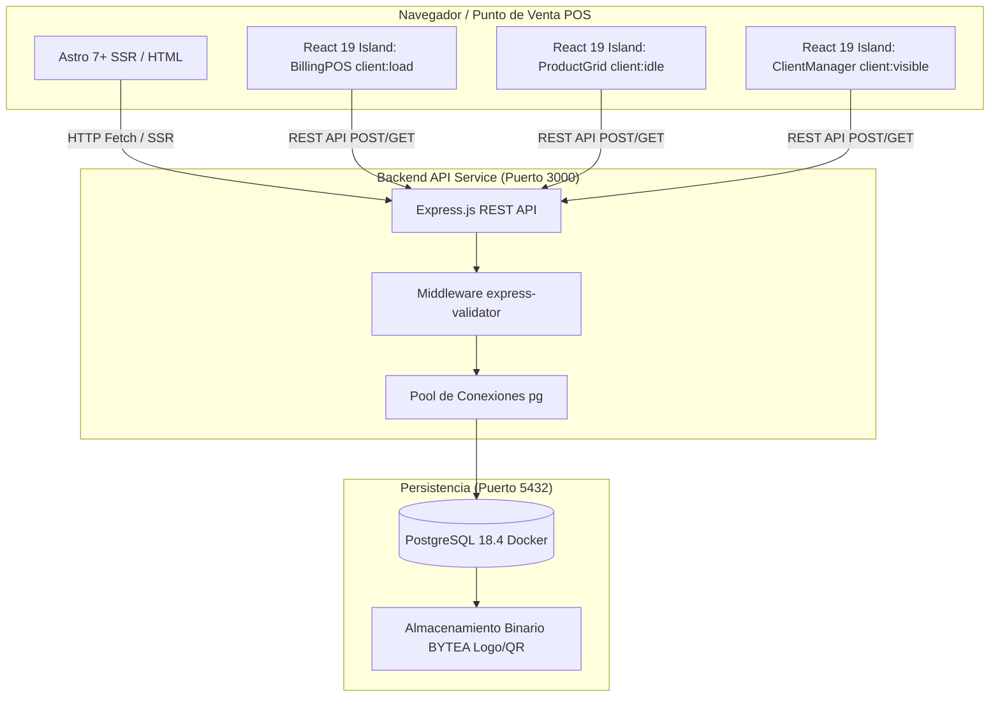

# Sistema de Facturación Enterprise · TumiFact 🏢⚡

[](https://github.com/TuMyXx93/TumiFact/actions/workflows/ci.yml)
[](https://nodejs.org)
[](https://astro.build)
[](https://react.dev)
[](https://tailwindcss.com)
[](https://www.postgresql.org)
[](LICENSE)

**TumiFact** es un sistema de facturación enterprise moderno y de alto rendimiento diseñado para emisión de comprobantes, gestión de inventarios por peso/unidad, clientes y generación de tiquetes térmicos de impresión (80mm y 58mm).

Construido bajo una **Arquitectura Híbrida Desacoplada**:
- **Frontend Presentation Layer:** Framework **Astro 7+** con **React 19 Islands** (hidratación selectiva) y **Tailwind CSS v4**.
- **Backend API Layer:** **Node.js Express** con pool de conexiones nativo a **PostgreSQL 18.4** en **Docker**.

---

## 📐 Arquitectura General del Sistema



---

## ⚡ Inicio Rápido (Desarrollo Local)

### 1. Requisitos Previos
- **Node.js:** v20.x / v22.x LTS o superior
- **pnpm:** v10.x / v11.x (`npm install -g pnpm`)
- **Docker & Docker Compose:** Activo en el sistema

---

### 2. Configuración e Instalación

```bash
# 1. Clonar el repositorio
git clone https://github.com/TuMyXx93/TumiFact.git
cd TumiFact

# 2. Instalar dependencias estrictas
pnpm install

# 3. Configurar variables de entorno
cp .env.example .env
```

---

### 3. Levantar la Base de Datos (PostgreSQL en Docker)

```bash
# Levantar el contenedor PostgreSQL 18.4 (tumifact_db)
docker-compose up -d

# Verificar estado de salud del contenedor
docker ps | grep tumifact_db
```

**Credenciales por defecto:**
- **Host:** `localhost` (Puerto: `5432`)
- **Usuario:** `tumifact_user`
- **Contraseña:** `tumifact_password`
- **Base de Datos:** `tumifact_db`

---

### 4. Iniciar los Servidores de Desarrollo

Para ejecutar el sistema completo se deben iniciar **Astro** (puerto `4321`) y el **Backend Express** (puerto `3000`):

```bash
# Opción A: Iniciar Frontend Astro (Puerto 4321)
pnpm dev

# Opción B: Iniciar API Express Backend (Puerto 3000)
pnpm dev:api
```

Navega en tu explorador web a: **`http://localhost:4321`**

---

## 📋 Comandos y Scripts del Proyecto

| Comando | Descripción / Propósito |
| :--- | :--- |
| `pnpm dev` | Inicia el servidor de desarrollo de **Astro** (`http://localhost:4321`) |
| `pnpm dev:api` | Inicia el servidor API **Express.js** con nodemon (`http://localhost:3000`) |
| `pnpm build` | Compila el bundle de producción optimizado de Astro (`/dist`) |
| `pnpm test` | Ejecuta la suite de pruebas unitarias/integración con Jest |
| `pnpm test:coverage` | Genera reporte de cobertura de código (mínimo 40% requerido) |
| `pnpm start` | Inicia el servidor Express en modo producción |

---

## 🗂️ Estructura de Directorios Enterprise

```
TumiFact/
├── .github/workflows/          # Pipelines CI/CD de GitHub Actions
├── .opencode/                  # Configuración de Agentes, Comandos y Memorias Engram
│   ├── agents/                 # Agentes especializados (architect, frontend, backend, etc.)
│   ├── commands/               # Comandos de gobernanza (/version-gate, /review, etc.)
│   └── memory/                 # Memorias persistentes del protocolo Engram (JSON)
├── docs/                       # Documentación Enterprise (Framework Diátaxis)
│   ├── adr/                    # Architectural Decision Records (ADRs)
│   ├── api/                    # Especificación detallada de endpoints REST
│   ├── architecture/           # Esquemas de BD y stack tecnológico
│   ├── features/               # Módulos del sistema (POS, Productos, Clientes)
│   ├── guides/                 # Guías de desarrollo, Git workflow y setup
│   └── runbook/                # Procedimientos operacionales y despliegue
├── public/                     # Archivos estáticos e iconos (favicon.svg)
├── routes/                     # Rutas y controladores API Express.js
├── src/                        # Capa de presentación Astro + React 19
│   ├── components/             # React Islands (BillingPOS, ProductGrid, ClientManager)
│   ├── layouts/                # Layout Maestro Astro (Layout.astro)
│   ├── lib/                    # Conectores y helpers ESM (db.js)
│   ├── pages/                  # Páginas SSR (.astro) e impresión (/facturas/[id]/imprimir)
│   ├── styles/                 # Tailwind CSS v4 y tokens globales (global.css)
│   └── types/                  # Interfaces TypeScript centralizadas (index.ts)
├── tests/                      # Suite de pruebas automatizadas (Jest + Supertest)
├── AGENTS.md                   # Protocolo de orquestación de agentes y estándares
├── astro.config.mjs            # Configuración de Astro 7+ con adaptador @astrojs/node
├── database_pg.sql             # Esquema DDL SQL inicial de PostgreSQL
├── docker-compose.yml          # Definición del contenedor PostgreSQL 18.4
├── package.json                # Dependencias y scripts del proyecto
└── tsconfig.json               # Configuración estricta de TypeScript
```

---

## 🌐 Endpoints Principales de la API REST

- **Facturación:**
  - `POST /api/facturas` — Crear comprobante con recálculo dinámico y verificación de totales.
  - `GET /api/facturas/:id/imprimir` — Vista e impresión de tiquete térmico (80mm / 58mm).
- **Productos:**
  - `GET /api/productos` — Listar productos del catálogo.
  - `GET /api/productos/buscar?q=term` — Búsqueda en tiempo real por código o nombre (`ILIKE`).
  - `POST /api/productos` — Crear nuevo producto (Precios KG, Libra, Unidad).
- **Clientes:**
  - `GET /api/clientes` — Listar clientes registrados.
  - `POST /api/clientes` — Crear cliente.
- **Configuración:**
  - `GET /api/configuracion` — Obtener ajustes de tiquete y datos de empresa.
  - `POST /api/configuracion` — Actualizar datos fiscal, logo (`BYTEA`) y QR (`BYTEA`).

---

## 📄 Documentación Completa del Proyecto

Para consultar guías detalladas, arquitectura de datos y estándares de desarrollo:
👉 **[Ver Índice de Documentación en docs/README.md](file:///home/tumidev/developments/TumiFact/docs/README.md)**

---

## 📜 Licencia y Derechos

Desarrollado y mantenido bajo estándares **Enterprise 2026**.
