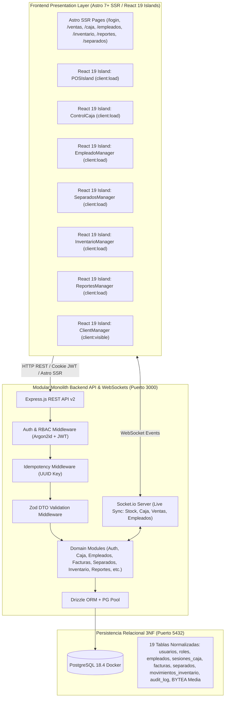

# Sistema de Facturación & POS · TumiFact 🏢⚡

[](https://github.com/TuMyXx93/TumiFact/actions/workflows/ci.yml)
[](https://nodejs.org)
[](https://astro.build)
[](https://react.dev)
[](https://tailwindcss.com)
[](https://www.postgresql.org)
[](LICENSE)

**TumiFact** es una plataforma moderna y modular de Punto de Venta (POS), Facturación e Inventario en tiempo real. Diseñada para alto rendimiento, alta disponibilidad y arquitectura desacoplada híbrida con **Astro 7+**, **React 19 Islands**, **Express.js API**, **Socket.io** y **PostgreSQL 18.4** (normalizado en 3NF con Drizzle ORM).

---

## 📐 Arquitectura General del Sistema



---

## ⚡ Inicio Rápido (Desarrollo Local)

### 1. Requisitos Previos
- **Node.js:** v20.x / v22.x LTS o superior
- **pnpm:** v10.x / v11.x (`npm install -g pnpm`)
- **Docker & Docker Compose:** Activo en el sistema

---

### 2. Configuración e Instalación

```bash
# 1. Clonar el repositorio
git clone https://github.com/TuMyXx93/TumiFact.git
cd TumiFact

# 2. Instalar dependencias estrictas
pnpm install

# 3. Configurar variables de entorno
cp .env.example .env
```

---

### 3. Levantar la Base de Datos y Semilla Inicial

```bash
# Levantar el contenedor PostgreSQL 18.4 (tumifact_db)
docker-compose up -d

# Ejecutar migración y seed de datos inicial (Roles, Usuarios Admin/Cajero, Catálogo)
pnpm tsx scripts/migrate-and-seed-v2.ts
```

**Credenciales Demo Preconfiguradas:**
- **Admin:** `admin@tumifact.com` | Documento: `10000001` | Password: `Password*2026`
- **Gerente:** `gerente@tumifact.com` | Documento: `10000002` | Password: `Password*2026`
- **Cajero:** `ventas1@tumifact.com` | Documento: `10000003` | Password: `Password*2026`

---

### 4. Iniciar los Servidores de Desarrollo

Para ejecutar el sistema completo se deben iniciar **Astro** (puerto `4321`) y el **Backend Express API con WebSockets** (puerto `3000`):

```bash
# Terminal 1: Iniciar Frontend Astro (Puerto 4321)
pnpm dev

# Terminal 2: Iniciar API Express Backend (Puerto 3000)
pnpm dev:api
```

Navega en tu explorador web a: **`http://localhost:4321`**

---

## 📋 Comandos y Scripts del Proyecto

| Comando | Descripción / Propósito |
| :--- | :--- |
| `pnpm dev` | Inicia el servidor de desarrollo de **Astro** (`http://localhost:4321`) |
| `pnpm dev:api` | Inicia el servidor API **Express.js** con nodemon y Socket.io (`http://localhost:3000`) |
| `pnpm build` | Compila el bundle de producción optimizado de Astro (`/dist`) |
| `pnpm test` | Ejecuta la suite completa de pruebas automatizadas con Jest y Base de Datos de prueba |
| `pnpm test:coverage` | Genera reporte de cobertura de código (mínimo 40% requerido) |
| `pnpm start` | Inicia el servidor Express en modo producción |

---

## 🗂️ Estructura de Directorios del Proyecto

```
TumiFact/
├── .github/workflows/          # Pipelines CI/CD de GitHub Actions (ci.yml, security.yml, sbom.yml)
├── .opencode/                  # Configuración de Agentes, Comandos y Memorias Engram
│   ├── agents/                 # Agentes especializados (architect, frontend, backend, reviewer, etc.)
│   ├── commands/               # Comandos de gobernanza (/version-gate, /review, etc.)
│   └── memory/                 # Memorias persistentes del protocolo Engram (JSON)
├── docs/                       # Documentación Diátaxis (ADRs, API, Arquitectura, Runbooks, Guías)
├── public/                     # Archivos estáticos e iconos (favicon.svg)
├── routes/                     # Rutas y controladores Express.js (v1 y v2 legacy/adapter)
├── scripts/                    # Scripts de migración, seed y utilidades operativas
├── src/                        # Capa de presentación Astro + React 19 + Backend Modular DDD
│   ├── components/             # React 19 Islands (pos, caja, empleados, inventario, reportes, separados, clientes)
│   ├── db/                     # Configuración Drizzle ORM, cliente PG Pool y Esquemas 3NF
│   │   └── schema/             # 19 Esquemas relacionales en TypeScript (facturas, usuarios, etc.)
│   ├── layouts/                # Layout Maestro Astro (Layout.astro)
│   ├── lib/                    # Clientes API, formatters y conectores
│   ├── modules/                # Módulos de Dominio DDD (Auth, Caja, Empleados, Facturas, Separados, etc.)
│   │   ├── auth/               # Controller, Service, Repository, DTO (Argon2id + JWT)
│   │   ├── caja/               # Gestión de sesiones y arqueos de caja
│   │   ├── empleados/          # CRUD, métricas de rendimiento, auditoría y roles RBAC
│   │   ├── facturas/           # Facturación POS, recálculos e idempotencia
│   │   ├── separados/          # Plan separador (Layaway) y registro de abonos
│   │   ├── inventario/         # Kardex y movimientos de stock
│   │   └── reportes/           # Generación de reportes PDF y CSV
│   ├── pages/                  # Páginas SSR Astro (/login, /logout, /ventas, /caja, /empleados, /inventario, etc.)
│   ├── server.ts               # Servidor HTTP Express + Socket.io Server
│   ├── styles/                 # Tailwind CSS v4 y tokens globales (global.css)
│   └── types/                  # Interfaces TypeScript centralizadas (index.ts)
├── tests/                      # Suite de pruebas automatizadas (Jest + Supertest + PG Test DB)
├── AGENTS.md                   # Protocolo de orquestación de agentes y estándares
├── astro.config.mjs            # Configuración de Astro 7+ con adaptador @astrojs/node
├── database_pg.sql             # Esquema DDL SQL PostgreSQL 18.4 (3NF)
├── docker-compose.yml          # Definición del contenedor PostgreSQL 18.4
├── package.json                # Dependencias y scripts del proyecto
└── tsconfig.json               # Configuración estricta de TypeScript
```

---

## 🌐 Módulos Principales de la API REST v2

- **Autenticación & Sesión (`/api/auth`):**
  - `POST /api/auth/login` — Autenticación dual (Email o Cédula) con hash Argon2id y tokens JWT/Cookie.
  - `POST /api/auth/logout` — Cierre de sesión y revocación.
  - `GET /api/auth/me` — Validación de identidad y rol activo.
- **Punto de Venta & Facturas (`/api/facturas`):**
  - `POST /api/facturas` — Emisión de comprobantes con control de idempotencia UUID, descuentos y recálculo.
  - `GET /api/facturas/:id/imprimir` — Render e impresión de tiquete térmico (80mm/58mm) con decodificación de `BYTEA`.
- **Control de Caja (`/api/caja`):**
  - `GET /api/caja/estado` — Estado de la sesión de caja del empleado y métricas de turno.
  - `POST /api/caja/abrir` / `POST /api/caja/cerrar` — Apertura y cierre con cálculo de descuadre y arqueo.
- **Separados & Abonos (`/api/separados`):**
  - `GET /api/separados` / `POST /api/separados` — Creación y seguimiento de separados con fechas límite.
  - `POST /api/separados/:id/abonos` — Registro de abonos parciales y liquidación.
- **Inventario & Stock (`/api/inventario`):**
  - `GET /api/inventario/movimientos` — Historial y auditoría de entradas, salidas y ajustes.
  - `POST /api/inventario/ajuste` — Ajustes manuales con registro en Kardex y sincronización WebSocket.
- **Colaboradores & Empleados (`/api/empleados`):**
  - `GET /api/empleados` — Directorio de colaboradores con roles, turnos y estado.
  - `GET /api/empleados/metricas` — KPIs y métricas de rendimiento consolidadas en tiempo real.
  - `GET /api/empleados/auditoria` — Logs de auditoría inmutables (`audit_log`).
  - `POST /api/empleados` / `PUT /api/empleados/:id` — Registro y actualización segura de colaboradores.
  - `PATCH /api/empleados/:id/toggle-status` — Activación o desactivación de accesos.
- **Supervisión & Monitoreo en Vivo (`/api/auth/empleados-estado`):**
  - `GET /api/auth/empleados-estado` — Monitoreo en vivo de cajeros conectados y turnos de caja en el Dashboard.
- **Reportes & Exportaciones (`/api/reportes`):**
  - `GET /api/reportes/ventas` — Exportación de ventas en formato CSV o PDF.
  - `GET /api/reportes/inventario` — Reporte de valorización y stock.

---

## 📄 Documentación Completa del Proyecto

Para consultar guías detalladas, arquitectura de datos y estándares de desarrollo:
👉 **[Ver Índice de Documentación en docs/README.md](file:///home/tumidev/developments/TumiFact/docs/README.md)**

---

## 📜 Licencia y Derechos

Desarrollado y mantenido bajo estándares **2026**.
