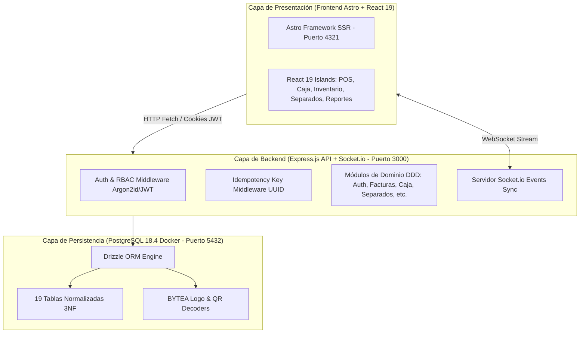

# Arquitectura General del Sistema — TumiFact 🏗️

> **Status**: ✅ Producción | v2.0.0  
> **Patrón**: Arquitectura Híbrida Desacoplada (Astro SSR + React 19 Islands + Express Headless REST API + WebSockets Socket.io + PostgreSQL 18.4 Normalizado en 3NF).

---

## 1. Visión General del Negocio y Sistema

**TumiFact** es un sistema integral de **Punto de Venta (POS), Facturación, Control de Caja, Inventario Multiformato y Planes de Separado (Layaway)**.

El sistema garantiza:
1. **Velocidad Extrema en Terminal POS**: Carga ultrarrápida gracias a la arquitectura de Islas de React 19 sobre Astro SSR.
2. **Sincronización en Tiempo Real**: Notificaciones instantáneas de cambios en existencias de inventario y estado de sesiones de caja a través de Socket.io.
3. **Consistencia Transaccional & Seguridad**: Persistencia relacional atómica en PostgreSQL 18.4 mediante Drizzle ORM, autenticación criptográfica con Argon2id, tokens JWT y control de idempotencia UUID.

---

## 2. Capas de la Arquitectura

---

## 3. Principios de Diseño
- **Domain-Driven Design (DDD)**: Cada módulo (`src/modules/`) contiene su propio Controller, Service, Repository y esquemas de validación Zod DTO.
- **Normalización 3NF**: El modelo relacional elimina duplicidades mediante tablas dedicadas como `tipos_identificacion`, `direcciones`, `roles`, `empleados` y `movimientos_inventario`.
- **Idempotencia Transaccional**: Toda operación de cobro o desembolso acepta una clave de idempotencia UUID única para prevenir cobros dobles en caso de fallos de red.
