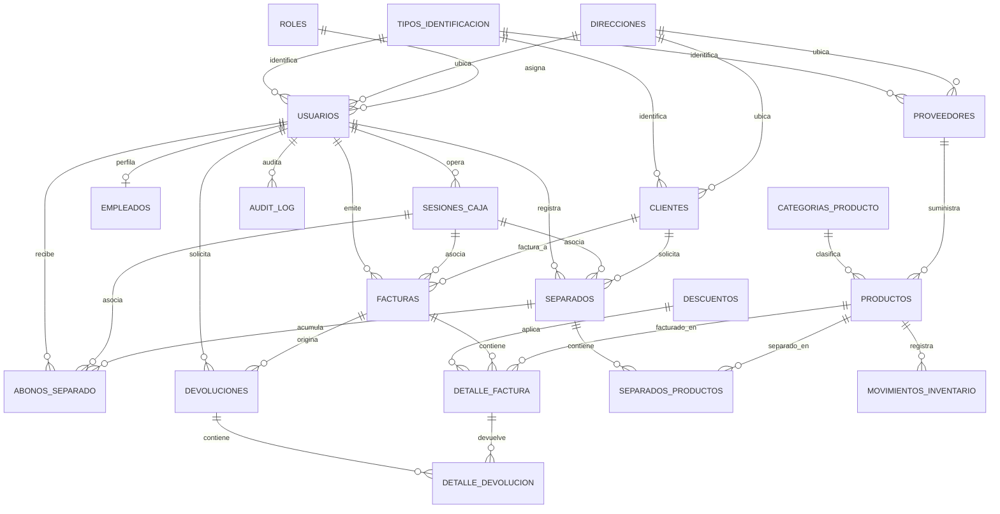

# Modelo de Base de Datos PostgreSQL — TumiFact 🗄️

> **Motor**: PostgreSQL 18.4 (Docker Alpine)  
> **ORM**: Drizzle ORM v0.45+ & SQL DDL Nativo  
> **Normalización**: 3NF (Tercera Forma Normal) con integridad referencial e índices de alto rendimiento.

---

## 📊 Diagrama Entidad-Relación (ER) Completo

---

## 🗂️ Diccionario de Entidades y Tablas (19 Entidades Normalizadas)

### 1. Núcleo de Seguridad y Usuarios
* **`tipos_identificacion`**: Catálogo de tipos de documento oficiales (`CC`, `NIT`, `CE`, `PP`, `TI`, `RUT`).
* **`direcciones`**: Almacenamiento normalizado de direcciones físicas (calle, barrio, ciudad, departamento, código postal).
* **`roles`**: Definición de perfiles y permisos RBAC en formato JSONB (`admin`, `gerente`, `empleado`).
* **`usuarios`**: Cuentas del sistema con credenciales hash `Argon2id`, bloqueo por intentos fallidos y auditoría.
* **`empleados`**: Perfil de nómina, turnos, cargo y políticas de límites de descuentos asignados al usuario.

### 2. Operación de Caja y Turnos
* **`sesiones_caja`**: Control de turnos de punto de venta. Registra apertura, cierre declarado, cálculo dinámico de ventas por medio de pago (efectivo, tarjeta, transferencia) y arqueo.

### 3. Catálogo, Inventario y Proveedores
* **`categorias_producto`**: Clasificación jerárquica con soporte de atributos dinámicos en JSONB.
* **`proveedores`**: Directorio de proveedores comerciales con términos de crédito y contacto.
* **`productos`**: Catálogo con precios múltiples (KG, Libra, Unidad, Detal, Mayorista), umbral mayorista y stock de seguridad.
* **`movimientos_inventario`**: Kardex y trazabilidad de entradas, salidas, ajustes de stock y costo unitario.

### 4. Facturación POS y Promociones
* **`descuentos`**: Promociones por porcentaje o valor fijo, aplicables a nivel de comprobante o línea.
* **`facturas`**: Cabecera de venta con clave de idempotencia UUID, cliente, sesión de caja, totales y descuentos.
* **`detalle_factura`**: Ítems de venta con precios congelados al momento de compra, cantidad y descuentos aplicados.

### 5. Plan Separador (Layaway) y Abonos
* **`separados`**: Contratos de compra a plazos con abono inicial, saldo pendiente y fecha límite de liquidación.
* **`separados_productos`**: Ítems apartados y reservados en el inventario para el cliente.
* **`abonos_separado`**: Registro de pagos parciales asociados a una sesión de caja activa.

### 6. Post-Venta y Auditoría
* **`devoluciones`**: Registro de devoluciones de mercancía con motivo, estado y usuario aprobador.
* **`detalle_devolucion`**: Ítems específicos devueltos e indicación de si retornan al inventario físico.
* **`audit_log`**: Registro inmutable de acciones críticas del sistema, IPs, timestamps y cambios de estado.
* **`configuracion_impresion`**: Ajustes de marca, tiquete térmico (80mm/58mm), logo (`BYTEA`), QR de pagos (`BYTEA`), colores y políticas.
