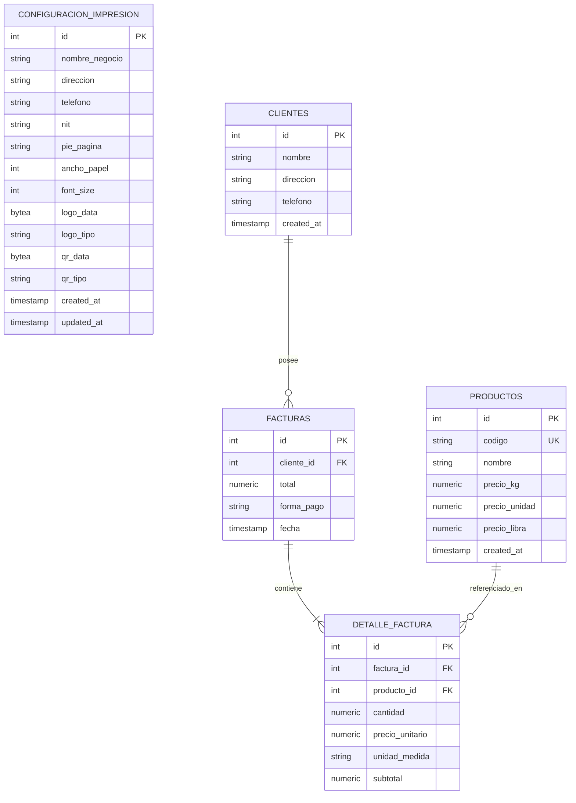

# Modelo de Base de Datos PostgreSQL — TumiFact 🗄️

## Diagrama Entidad-Relación (ER)

## Especificación de Tablas

### 1. `configuracion_impresion`
Almacena la configuración general de datos fiscales del negocio y los assets gráficos binarios (`BYTEA`) para el tiquete térmico.

### 2. `productos`
Almacena el catálogo de productos con precios por unidad de medida (Kilogramo, Libra, Unidad).

### 3. `clientes`
Directorio de clientes para emisión de facturas.

### 4. `facturas` y `detalle_factura`
Encabezado y líneas de detalle de transacciones de venta de la caja POS.
